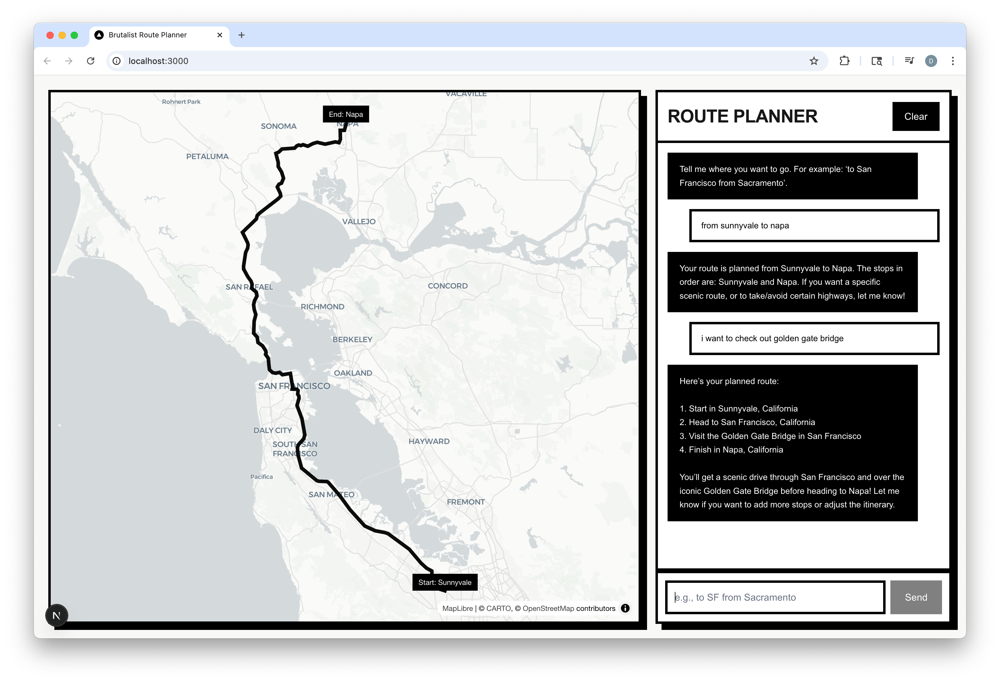

# Route Cause Analysis

> Agent‑powered route diagnostics. Licensed to route. Extremely employable.

[](https://nextjs.org)
[](https://react.dev)
[](https://www.typescriptlang.org)
[](https://tailwindcss.com)
[](https://maplibre.org)
[](https://www.geoapify.com)
[](https://platform.openai.com)
[](https://github.com/pmndrs/zustand)
[](https://nextjs.org/docs/app/building-your-application/deploying/turbopack)
[](https://nodejs.org)
[](./)
[](./README.md)



A lot of you have been asking me how I plan world‑class road trips while simultaneously crushing OKRs, networking at 6 AM, and drinking coffee that tastes like venture capital. So over a single focused weekend (between eight meetings and a cold plunge), I built Route Cause Analysis: a brutalist chat + map app where an Agent plans your route and then we pretend it was “strategy.”

Because sometimes the real cause of the route is the friends we made via waypoints along the way.

## What It Does (in manager‑speak)

- Leverages state‑of‑the‑art Agents to synergize geospatial itineraries.
- Aligns cross‑functional waypoints with stakeholder preferences (e.g., “take Highway 1”).
- Operationalizes geocoding and routing KPIs for maximum map visibility.
- Delivers outcomes on time and on map.

Translation: you type “to San Francisco from Sacramento via the coast,” the Agent returns real places (start, via, end), we geocode with Geoapify, fetch a route, and draw a chunky black line that screams “design system.”

## Demo (imagine a glamorous GIF here)
- Chat tells the Agent your vibe → Agent proposes waypoints → server geocodes → server fetches route → MapLibre renders → you become unreasonably confident.

## Under the Hood (actual facts)
- UI: Next.js App Router + Tailwind v4 styles in `app/` with a bold/brutalist aesthetic.
- Agent: `@openai/agents` with a single `submit_route_plan` tool that returns ordered waypoints.
- Geocoding: Geoapify Autocomplete API.
- Routing: Geoapify Routing API.
- Map: MapLibre GL via `react-map-gl/maplibre`.
- State: `zustand` store for waypoints and route geometry.

## Run It Locally
1) Requirements
- Node 18+ and npm (or pnpm/yarn/bun if you like living dangerously).
- A free Geoapify API key (for geocoding + routing).

2) Configure env
```bash
cp .env.example .env
```
Edit `.env` and set:
```
GEOAPIFY_API_KEY=your_key_here
```

3) Install + dev
```bash
npm install
npm run dev
# open http://localhost:3000
```

## Architecture (napkin sketch)
```
[Chat UI]
   ↓
POST /api/agent/run → @openai/agents → submit_route_plan
   ↓                              ↳ returns [{query,label,role}] (no coords)
POST /api/geocode/resolve → Geoapify Autocomplete
   ↓
POST /api/routing → Geoapify Routing → GeoJSON
   ↓
[MapLibre renders line + pins]
```

Key files if you want to poke around:
- `lib/agent.ts` – agent + tool definition and instructions.
- `app/api/agent/run/route.ts` – runs the agent.
- `app/api/geocode/resolve/route.ts` – geocodes waypoints.
- `app/api/routing/route.ts` – fetches the route GeoJSON.
- `components/Chat.tsx` – chat UI that orchestrates all calls.
- `components/MapView.tsx` – bold line; unapologetic pins.

## FAQ (LinkedIn edition)
- Will this 10× my career? Yes, if your manager sees the tags at the top.
- Where’s the blockchain? In spirit. Also: not everything needs a chain, Brad.
- Is this production‑ready? It’s weekend‑ready. Bring your own rate‑limits.
- Can I pivot this to a platform? Rebrand to “Turn‑as‑a‑Service (TaaS)” and raise a seed.
- Does it replace PMs? No, but it will route you to them faster.

## Make It Yours
- Rename things in:
  - `app/layout.tsx` (`metadata` title/description)
  - `app/page.tsx` (header title)
  - `lib/agent.ts` (agent name)
  - `package.json` (package name)

## Fine Print
- You’ll need a Geoapify API key. Free tiers exist; read their docs for quotas and terms.
- This repo ships no secrets. Keep your keys in `.env`.
- No warranty, except that the line will be very bold.

If this made you chuckle, leave an endorsement for “Route Architecture” and “Pun Engineering.” If it didn’t, please remember: engagement is engagement.
